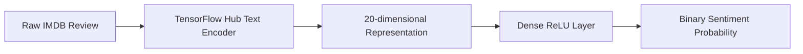

# Text Classification with Deep Learning

**TensorFlow sentiment-classification study using the IMDB Reviews dataset and a trainable text-embedding pipeline.**

## Problem Statement

The project examines how raw review text can be transformed into a compact representation and classified as positive or negative without manual feature engineering.

## Architecture



## Results

The recorded notebook run reports:

- **85.1% test accuracy**;
- **0.320 test loss**; and
- 400,373 trainable parameters.

The validation curve improves through the recorded 20 epochs, with a growing train/validation gap near the end that should be treated as an overfitting signal.

## Tech Stack

- Python
- TensorFlow 2 and TensorFlow Hub
- TensorFlow Datasets: IMDB Reviews
- Jupyter Notebook

## Repository Structure

```text
Text_Classification_with_Deep_Learning.ipynb  Training and evaluation
text_classification.tar.gz                    Exported TensorFlow SavedModel
tests/                                        Repository smoke checks
```

## Setup

```bash
python -m venv .venv
source .venv/bin/activate
pip install -r requirements.txt
jupyter notebook Text_Classification_with_Deep_Learning.ipynb
```

## Testing

```bash
pytest -q
```

## Limitations

- The notebook uses an older TensorFlow Hub text-encoder API.
- The model evaluates binary English-language movie-review sentiment only.
- No robustness, calibration, subgroup, or out-of-domain evaluation is included.
- The SavedModel archive is a reproducibility artifact, not a production service.

## Future Improvements

- Migrate to a current text-vectorization or transformer encoder
- Add precision, recall, F1, calibration, and confusion analysis
- Use early stopping and controlled hyperparameter experiments
- Evaluate domain shift and adversarial phrasing
- Package inference behind a versioned API with monitoring
